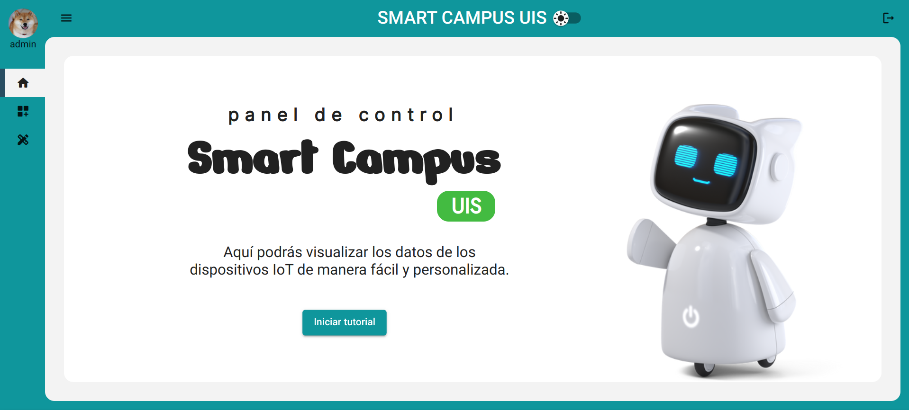
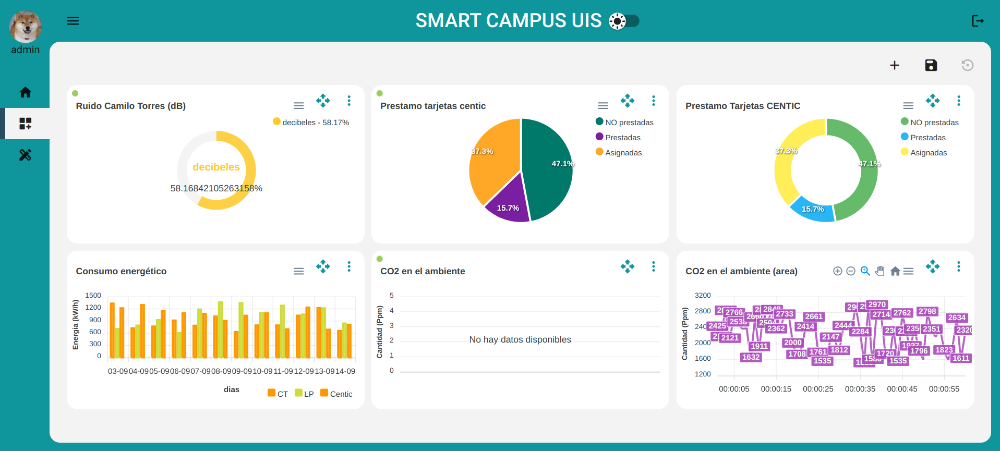
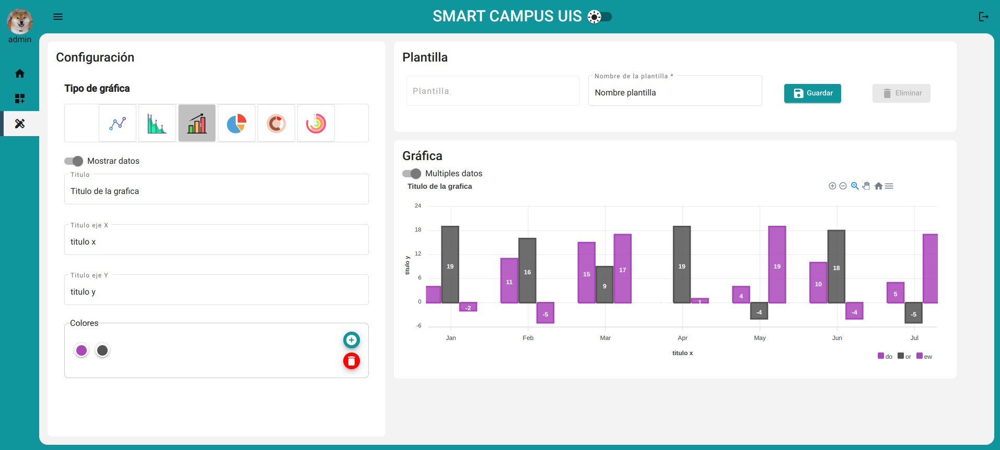
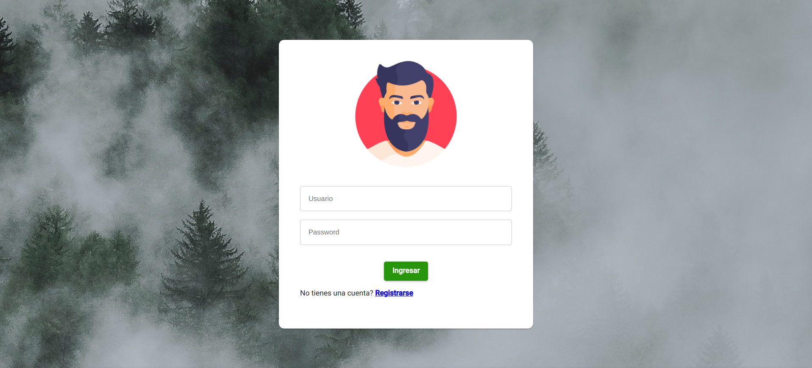

# Hi there, I'm Felipe Rojas 🚀🎮
I'm software ingenier

### Languages and Tools:
<ul class="lista">

</ul>

## My projects

### Smart campus dashboard

Aplicacion de un sistema de un campus universitario que recopila informacion de diferentes sensores y que utiliza estos datos para ser ingresados en graficas personalizadas por el usuario.

### Auth frontend

Front en angular para manejar la autenticacion con JWT y spring boot, utilizando interceptores y authGuard

### Bot microsft teams and AWS Connect

Una aplicacion intermediaria entre un bot de Microsft Teams y el servicio de AWS connect, utilizado para el sistema atencion al cliente. permite la comunicacion bilateral entre ambos sistemas.

### Icons used [simple-icons]('https://github.com/simple-icons/simple-icons/tree/master')

<!--
**mannuluss/mannuluss** is a ✨ _special_ ✨ repository because its `README.md` (this file) appears on your GitHub profile.

Here are some ideas to get you started:

- 🔭 I’m currently working on ...
- 🌱 I’m currently learning ...
- 👯 I’m looking to collaborate on ...
- 🤔 I’m looking for help with ...
- 💬 Ask me about ...
- 📫 How to reach me: ...
- 😄 Pronouns: ...
- ⚡ Fun fact: ...
-->
